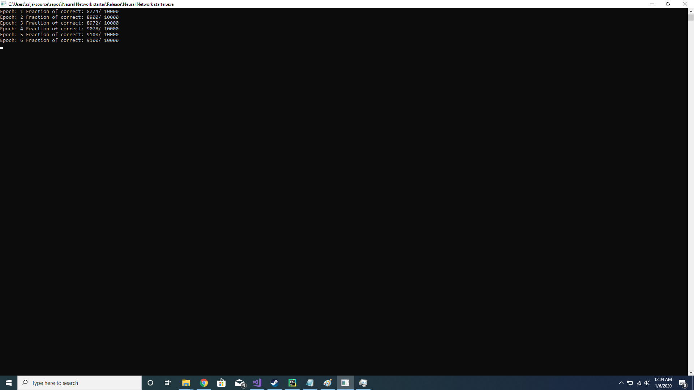

# Neural-Network--Digit-Recognition
A digit recognition neural network that takes in the MNIST training data of grey map images as input and learns to produce a neural network. No external API's were used and everything was done in C++ alone. This was my first attempt to understand neural networks.

Settings for the Neural Network: 
-Classification type network. 
-2 hidden layers(200 neurons each).

Acknowledgment: Michael Nielsen for his book "Neural Networks and Deep Learning" with the information of everything in how neural networks work. link: http://neuralnetworksanddeeplearning.com/

Output

