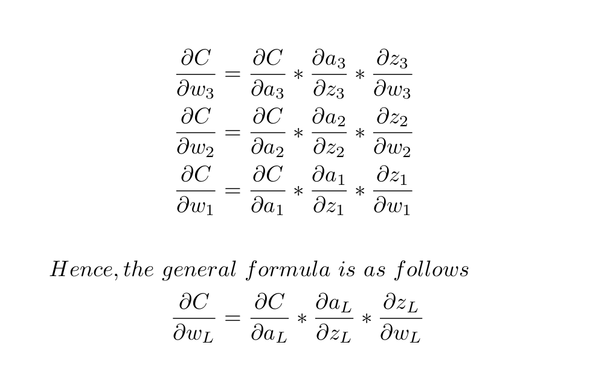

# Table Of Contents
- [Introduction](#introduction)
- [How To Compile And Run](#how-to-compile-and-run)
- [Checking The Output Files](#checking-the-output-files)
- [Program Output](#program-output)
- [Theory Behind The Neural Network](#theory-behind-the-neural-network)
  * [Gradient Descent](#gradient-descent)
  * [Stochastic Gradient Descent](#stochastic-gradient-descent)
  * [How To Find The Values Of The Gradient](#how-to-find-the-values-of-the-gradient)
    + [dC/dw](#dc-dw)
    + [dC/db](#dc-db)
    + [What Changes When Having Multiple Neurons Per Layer](#what-changes-when-having-multiple-neurons-per-layer)
- [Acknowledgment](#acknowledgment)
# Introduction
This is a neural network I wrote to recognize the `MNIST` handwritten digits dataset. This was my first attempt in making a neural network and I primarily made this program to aide in my understanding of how all of this works.

I did not use any matrix libraries as I felt that for a beginner they provided an extra layer of complexity in understanding the fundamentals. I felt that thinking about each and every neuron would make learning better.

I did not copy any other similar projects. As far as I know, how I implemented the neural network is pretty unique. I used actual graphs and traversed through those graphs, instead of representing the weights and biases performing the operations.

However, this approach did have an affect on the performance of my neural network. I did not care much about this because the project was primary made with the goal of learning.

# How To Compile And Run
If on Linux or Mac, use the Makefile in the "Neural Network starter" folder.
If on Windows, use the make.bat script or load the project into Visual Studio.

Basically, just compile all the `.cpp` and `.h` files into one executable binary.

# Checking The Output Files
I have made it so that the program will test the neural network every epoch of training with the `MNIST` testing data. This test will be outputted into the "Epoch_ Testing" files, where the "_" is the file number. These files are interesting and you can see how the neural network performs.
# Program Output

# Theory Behind The Neural Network

## Gradient Descent
From multi-variable calculus, we know that if there is a function, `f(x, y)`, then the vector `<df/dx, df/dy>` gives the path of steepest ascent.

I.E `-<df/dx, df/dy>` gives the path of the steepest descent (this is what we want to minimize our cost function).

- Lets say we take random values of x and y. Now let the new value of x be `(x - df/dx)` and y be `y - df/dy`.
- Now repeat this continuously. Eventually, you will come to the point that the values of x and y do not change by that much anymore. 
- This is the point of a local minimum and you will notice that among all the values of x and y that you have gotten along the way, the final pair of x and y will give the lowest value of `f(x, y)`

This particular algorithm is called gradient descent. This will work for a function that takes in any number of arguments, not just 2 like in the case for `f(x, y)`.

In the case of our neural network, we have a particular cost function that takes in all the weights and biases as the parameters. The goal of learning is to adjust these parameters to exactly the right value so that the cost function is minimized for our training data.

So, basically what we need to find is `dC/dw`, the gradient with respect to the weights, and `dC/db`, the gradient with respect to the biases.

What we do is to recursively find these values and follow gradient descent. Doing this will gradually improve the values of the weights and biases, and by the end, our network will have gotten much better at classifying the images than in the case of the initial random values of the weights and biases.

## Stochastic Gradient Descent 
Lets say we have 10,000 training examples for our neural network to learn from. If we follow gradient descent, then produce is to find the average values of `-dC/dw` and `-dC/db` gotten from all the training sets and then only add them to the respective weights and biases.

This, though working, is very slow. This can simply be improved by diving the training data into small random chucks, then add the average values of `-dC/dw` and `-dC/db` gotten from those small chunks.

This slight change is called Stochastic Gradient Descent instead of Gradient Descent.

This significantly improved the performance. The caveat is that we need to find the apt size for those small chunks. If those chunks are too small. The network will not learn at all.

## How To Find The Values Of The Gradient 

It is easier to explain how the network works by first imagining the network to contain a single neuron in each layer like the one shown above.

Here, we are trying to find `dC/dw` and `dC/db` for each weight and bias.

The cost(C) = (a3-y)^2    where y is the activation the final neuron should have had.

### dC/dw

For the final layer, `dC/dw` is easily calculable because of the following equations.

In fact, `dC/dw` can we found for every weight because of the following pattern.

In this general formula, `da/dz` and `dz/dw` both can be found without the need for backpropagation because of the following equations. 

To find, `dC/dw`, we need `dC/da`, `da/dz` and `dz/dw`
Since, both `da/dz` and `dz/dw` can be found directly, the only thing we need backpropagation for is `dc/da`.

So, let's take a look at the following sequence for our dummy network.

In this general formula, both `dz/da` and `da/dz` can be found directly without the need for backpropagation. This because of the following equations.
	

Hence, we can calculate `dC/da` by backpropagation after each successive layer.

And because of this, we can also find `dC/dw` for each layer.
Hence, `dC/dw` is solved.

### dC/db

Finding `dC/db` is very similar to finding `dC/dw`. It just follows the following pattern

These values of `dC/da` and `da/dz` are the same as we calculated for `dC/dw`.

Hence, we can find `dC/db` by back propagation.

### What Changes When Having Multiple Neurons Per Layer

So, what happens when we change from the simple dummy network shown above to having multiple neurons per layer like below.

Actually, nothing changes except for finding `dC/da`.

In the single neuron per layer case, we used the `activations` and `z_values` from each successive neurons to find `dC/da` through backpropagation.

But in this case, we have multiple neurons in successive layers. Therefore, just calculate `dC/da` from each of those multiple successive neurons like we did before. But this time, we add all those values to get the final `dC/da`.

Now that we have `dC/da`, calculating `dC/dw` and `dC/db` is just like for the simple network.

# Acknowledgment
I loved Michael Nielsen's excellent book "Neural Networks and Deep Learning" with the information of everything in how neural networks work. I built this software by learning from that book. link: http://neuralnetworksanddeeplearning.com/

This playlist by 3Blue1Brom was also very helpful 
https://www.youtube.com/playlist?list=PLZHQObOWTQDNU6R1_67000Dx_ZCJB-3pi

I got the dataset from here:
http://yann.lecun.com/exdb/mnist/
