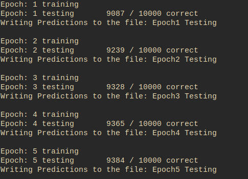

# Neural-Network--Digit-Recognition
A digit recognition neural network that takes in a the MNIST training data of grey map images as input and  learns to produce a neural network. No external API's were create and everything was done in C++ alone. This was my first attempt to understand neural networks.

2 hidden layers.

Output

